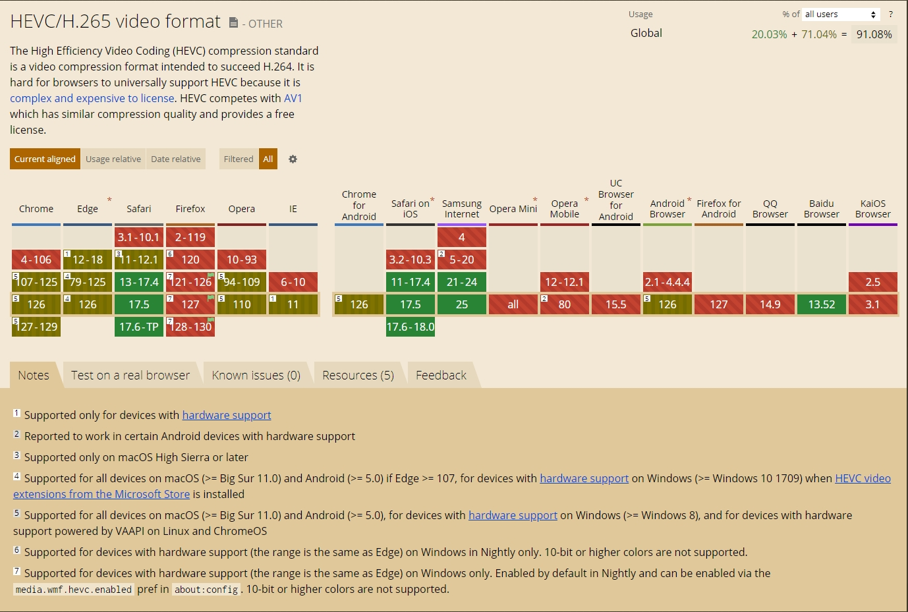

# 前端多媒体

## 一、音视频基础

### 1、视频

#### 基本概念

**码率：** 比特率（bit/s或bps），表示每秒传送的比特数，又称数据信号速率
**帧率：** 视频帧率，可以理解为图形处理器每秒钟能够刷新多少次
**压缩率：** 经过压缩后文件的大小 / 原始文件的大小 * 100% = 压缩率

> 压缩率一般是越小越好，但是压的越小，解压时间越长
>
> **常见编码格式压缩率**
> 举例：视频文件3840x2160.yuv（大小：3.6GB，分辨率：3840x2160 4k 帧率25fps，码率：10Mbps），使用H.265编码方式压缩后文件大小15MB
>
> H.265编码方式下，压缩文件：15MB，压缩率为: 15 / 3600 * 100% ≈ 0.42%
> H.264编码方式下，压缩率是H.265的 1/2

#### 容器格式

**视频格式：** 我们平时所说的视频格式主要分为两种，一个是封装格式，另一个是编解码格式。

**封装格式：**​ 视频封装格式就是将已经编码处理的视频数据、音频数据、字幕数据等按照一定的方式放到一个文件中。例如：MP4、AVI、WebM等等。

**MP4：** 又称MPEG-4第14部分（MPEG-4 Part 14），由国际标准化组织（ISO）和国际电工委员会（IEC）下属的”动态图像专家组“（Moving Picture Experts Group，即MPEG）制定。

**AVI：** 音频视频交错格式，由微软在1992年11月推出的一种多媒体文件格式，用于对抗苹果Quicktime的技术。

**WebM：** 由Google提出，是一种专为Web设计的开放，免版税的媒体文件格式。WebM 影片格式其实是以 Matroska（即 MKV）容器格式为基础开发的新容器格式，里面包括了VP8影片轨和 Ogg Vorbis 音轨。

**MOV：** MOV视频容器是Apple Quicktime中经常使用的一种常见的多媒体格式，它使用Apple Computer开发的专有压缩算法来保存电影和其他视频文件。

**FLV：** FLV（Flash Video）是现在非常流行的流媒体格式，由于其视频文件体积轻巧、封装播放简单等特点，使其很适合在网络上进行应用，现各视频网站大多使用的是FLV格式。

#### 编码格式

**MPEG系列：** MPEG-1第二部分主要使用在VCD上，有些在线视频也使用这种格式。MPEG-2第二部分等同于H.262，使用在DVD、SVCD和大多数数字视频广播系统和有线分布系统(cable distribution systems)中。MPEG-4第二部分标准可以使用在网络传输、广播和媒体存储上。

**H.264：** 又称MPEG-4 Part 10，高级视频编码或AVC。是由ITU-T视频编码专家组（VCEG）和ISO/IEC动态图像专家组（MPEG）联合组成的联合视频组（JVT，Joint Video Team）提出的高度压缩数字视频编解码器标准。


**H.265：** 又称MPEG-H Part2或HEVC，由视频编码联合协作小组（JCT-VC）开发，旨在在有限带宽下传输更高质量的网络视频，与H.264相比，同样的视觉质量的视频只占用一半的空间，仅需原先的一半带宽即可播放相同质量的视频，或者具有相同文件大小和比特率的视频可能看起来更好。



**H.266：** 也被称为多功能视频编码（Versatile Video Coding，简称 VVC），是 H.265 的继任者。VVC 对 8K 超高清、屏幕、高动态和 360 度全景视频等新的视频类型以及自适应带宽和分辨率的流媒体和实时通信等应用有了更好的支持。

**VP9：** VP9是一个由Google开发的开放格式、无使用授权费的视频压缩标准。VP9支持从低比特率压缩到高质量超高清的所有Web和移动用例，并额外支持10/12位编码和HDR。

**AV1：** 是由AOM（Alliance for Open Media，开放媒体联盟）制定的一个开源、免版权费的视频编码格式，目标是解决H265昂贵的专利费用和复杂的专利授权问题并成为新一代领先的免版权费的编码标准。此外，AV1是google制定的VP9标准的继任者，也是H265强有力的竞争者。

<table summary="常用编解码器">
    <caption>常用编解码器</caption>
    <tr>
        <th>编解码器简称</th>
        <th>编解码器全称</th>
        <th>容器支持</th>
    </tr>
    <tr>
        <td>MPEG-1</td>
        <td>MPEG-1 Part 2 Visual</td>
        <td>MPEG、QuickTime</td>
    </tr>
    <tr>
        <td>MPEG-2</td>
        <td>MPEG-2 Part 2 Visual</td>
        <td>MP4、MPEG、QuickTime</td>
    </tr>
    <tr>
        <td>AVC(H.264)</td>
        <td>Advanced Video Coding（高级视频编码器）</td>
        <td>3GP、MP4</td>
    </tr>
    <tr>
        <td>HEVC(H.265)</td>
        <td>Advanced Video Coding（高级视频编码器）</td>
        <td>3GP、MP4</td>
    </tr>
    <tr>
        <td>VP9</td>
        <td>Video Processor 9</td>
        <td>MP4、Ogg、WebM</td>
    </tr>
    <tr>
        <td>AC1</td>
        <td>AOMedia Video 1</td>
        <td>MP4、WebM</td>
    </tr>
</table>

## 二、 直播技术

### 1、推拉流


1. 经过输出设备得到原始的采样数据--视频数据和音频数据
2. 使用硬编码（对应系统的API）或软编码（FFMpeg等）来编码压缩音视频数据
3. 然后根据不同的封装格式（如FLV、TS、MPEG-TS）进行封装打包
4. 通过不同的传输协议（如RTMP、RTP等）将流上传到服务器
5. 服务器进行节点分发（CDN）
6. 用户侧通过不同的传输协议（如RTMP、HLS、HTTP-FLV等）获取流数据
7. 同步骤3、2反向解封装和解码音视频数据
8. 进行渲染播放

### 2、流媒体协议

**RTMP：** RTMP是Real Time Messaging Protocol（实时消息传输协议）的首字母缩写，在合适的传输协议（如TCP）的基础上设计用于多路复用和包装多媒体传输流（如音频、视频和交互式内容）的应用层协议，主要用于Flash，一般使用flv格式的媒体流。

**RTP/RTCP/RTSP：** RTP和RTCP都是基于UDP，用作数据传输。RTSP是基于TCP的，属于应用层协议，是一种双向实时数据传输协议，它允许客户端向服务端发送请求，如回放、快进、倒退等操作。


**HTTP-FLV：** FLV是Adobe公司提出一种视频格式，由于协议简单、传输体积小而被广泛采用，而常见的HTTP-FLV流媒体协议是通过HTTP协议将FLV封装过的视频内容、音频内容流式传输到端上，从而实现直播播放诉求。

**HLS：** HLS (HTTP Live Streaming) 是 Apple 提出的直播流协议，它诞生于2009年，一个意在颠覆流媒体产业的新协议。它的工作原理是把一段视频流切分成一个个的小块，并基于 HTTP 的文件来下载。主要用于直播回放，缺点是延迟比较大，通常不低于10s。

<table summary="流媒体协议">
    <caption>流媒体协议</caption>
    <tr>
        <th>协议</th>
        <th>传输协议</th>
        <th>视频封装格式</th>
        <th>延时</th>
        <th>数据分段</th>
        <th>HTML5</th>
        <th>其他</th>
    </tr>
    <tr>
        <td>RTMP</td>
        <td>TCP长连接</td>
        <td>flv</td>
        <td>1-3s</td>
        <td>连续流</td>
        <td>不支持</td>
        <td>服务端压力大，客户端兼容性差</td>
    </tr>
    <tr>
        <td>HTTP-FLV</td>
        <td>HTTP长连接</td>
        <td>http</td>
        <td>1-3s</td>
        <td>连续流</td>
        <td>支持</td>
        <td>不支持多音频流、多视频流，不便于拖进度条</td>
    </tr>
    <tr>
        <td>HLS</td>
        <td>HTTP短连接</td>
        <td>http</td>
        <td>5-20s（依切片情况）</td>
        <td>切片</td>
        <td>支持</td>
        <td>播放时需要多次请求，对网络要求高，专利保护</td>
    </tr>
</table>

**DASH：** 基于HTTP的动态自适应流，也称MPEG-DASH，是一种自适应比特率流技术，使高质量流媒体可以通过传统的HTTP网络服务器以互联网传递。类似苹果公司的HTTP Live Streaming（HLS）方案。


## 三、 播放器

### 1、拉流

video元素本身支持h264编码的mp4、vp8编码的webm、theora编码的ogg视频格式。浏览器内部处理拉流逻辑。
对于像flv格式的视频流数据，我们需要自行拉取数据。

```javascript
fetch(this.url, {
  method: "GET"
}).then(resp => {
  const { status, statusText } = resp;
  resp.body.getReader().then(result => {
    let { value, done } = result;
    value = new Uint8Array(value ? value : 0);
    this.data = concat(this.data, value);
    if (done) {
      this.done = true;
    } else if (this.data.length < this.chunkSize) {
      // ...,
    }
  });
});
```

### 2、解封装

mux为Multiplex的缩写，封装之意，而 demux 即为解封。
通过 muxing（混流），可以将视频流、音频流甚至是字幕流合并到一个单独的文件中，作为一个信号进行传输。等传输完毕，就可以通过 demux（分离） 将里面的视频、音频或字幕分解出来各自进行解码和播放。


### 3、解码

SPS、PPS、IBP帧等等

### 4、渲染

渲染，指的是将解码后的数据，在 pc 硬件上（显示器、扬声器）进行播放。负责渲染的模块我们称之为渲染器(Render)。


**MSE：** 媒体源扩展 API（MSE）提供了实现无插件且基于 Web 的流媒体的功能。使用 MSE，媒体串流能够通过 JavaScript 创建，并且能通过使用 `<audio>` 和 `<video>` 元素进行播放。

**EME：** 加密媒体扩展（EME）是由W3C媒体工作组维护的一个开源项目，旨在为Web平台提供一个标准化接口，用于处理加密和受保护的数字媒体内容。通过EME，开发者能够构建支持数字版权管理（DRM）系统的Web应用，确保多媒体内容在传输和播放过程中的安全性。

**DRM：** 数字版权管理（Digital Rights Management）是以一定的计算方法，实现对数字内容的保护, 也可以解释为, 内容数字版权加密保护技术。

**CDM：** 内容解密模块（Content Decryption Module），客户端或者使用端软件或硬件提供的一个机制，可以播放加密内容。

## 四、Web媒体技术

### 1、WebRTC

网页即时通信（英语：Web Real-Time Communication），它允许网络应用或者站点，在不借助中间媒介的情况下，建立浏览器之间点对点（Peer-to-Peer）的连接，实现视频流和（或）音频流或者其他任意数据的传输。WebRTC包含的这些标准使用户在无需安装任何插件或者第三方的软件的情况下，创建点对点（Peer-to-Peer）的数据分享和电话会议成为可能。

WebRTC的能力使其适用于各种实时通信场景

- 点对点通讯：WebRTC 支持浏览器之间进行音视频通话，例如语音通话、视频通话等；
- 电话会议：WebRTC 可以支持多人音视频会议，例如腾讯会议、钉钉会议等；
- 屏幕共享：WebRTC 不仅可以传输音视频流，还可以用于实时共享屏幕；
- 直播：WebRTC 可以用于构建实时直播，用户可以通过浏览器观看直播内容。

WebRTC 主要由三部分组成：浏览器 API、音视频引擎和网络 IO。


RTC 会采用 RTP/RTCP 作为应用层协议保证音视频的正常传输。VP8和H.264是WebRTC中主要使用的视频编解码器。


### 2、WebAssembly

WebAssembly 或者 wasm 是一个可移植、体积小、加载快并且兼容 Web 的全新格式，是由主流浏览器厂商组成的 W3C 社区团体制定的一个新的规范。

WebAssembly是一种新的编码方式，可以在现代的网络浏览器中运行，它是一种低级的类汇编语言，具有紧凑的二进制格式，可以接近原生的性能运行，并为诸如 C/C ++等语言提供一个编译目标，以便它们可以在 Web 上运行。它也被设计为可以与 JavaScript 共存，允许两者一起工作。

WebAssembly在视频处理中的应用如下：

- 编解码器


- 视频帧处理

## 五、开源产品与框架

**flv.js：** flv.js是Bilibili网站开源的HTML5 flv播放器，基于HTTP-FLV流媒体协议，通过纯js实现FLV转封装，使flv格式文件能在web上进行播放。

**hls.js：** hls.js是基于HLS协议开发，利用Media Source Extension，用于实现HLS在web上播放的一款js播放库。

**video.js：** video.js是一款基于html5的播放器，同时支持h5和flash播放，并且拥有超过100个插件可进行使用，可满足hls、dash格式播放，支持定制主题，字幕扩展等不同层次的诉求，在世界范围拥有大量的应用场景。

**FFmpeg：** FFmpeg是一套领先的多媒体框架，是一套开源且跨平台的多媒体解决方案，提供了音视频的编码、解码、转码、封装、解封装、流媒体、滤镜、播放等功能。同样可以使用wasm版本的FFmpeg，ffmpeg.wasm（<https://github.com/ffmpegwasm/ffmpeg.wasm）。>

**OBS：** OBS（Open Broadcaster Software）是一个用于录制和进行网络直播的自由开源软件包。OBS使用C和C++语音编写，提供实时源和设备捕获、场景组成、编码、录制和广播。数据传输主要通过实时消息协议（RTMP）完成，可以发送到任何支持RTMP的目的地，包括YouTube、Twitch.tv、Instagram和Facebook等流媒体网站。

## 六、可落地应用

无缝切流、自动分辨率、Web推流、视频剪辑、视频编解码器、视频合成。
